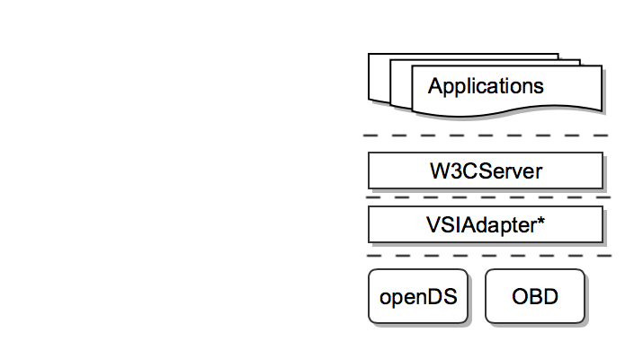
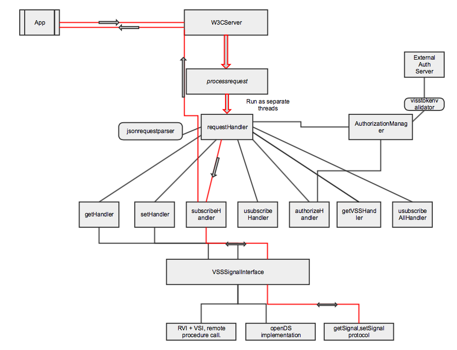

# Author
Peter Winzell MSc, Mitsubishi Electric, Gothenburg office. 2017-24-03, draft version.

# Abstract

The ability to access vehicle data signals with a standardized API opens up for innovation and feature growth outside the vehicle maker. It is also facilitating application development within the car - when there is a standard way of accessing signals, application developers can target multiple vehicles across OEM brands. 

  The W3C Automotive Working Group is currently developing specifications allowing developers to "write applications running in a web browser or an embedded web runtime on a car’s infotainment system to access signals from vehicle sensors and to carry out actions via the vehicles actuators" [[1]](https://www.w3.org/blog/auto/2017/01/04/vehicle-data-interfaces/). The applications can also be developed complete apart from the web runtime as any application framework that supports web sockets will be enough. 
  
  This is a reference implementation of the W3C Vehicle Information Service specification [[2]](https://github.com/w3c/automotive/blob/gh-pages/vehicle_data/vehicle_information_service.html). The implementation is done on the GDP-11 [[3]](https://at.projects.genivi.org/wiki/pages/viewpage.action?pageId=14090346) platform targeting the RPI3 as its primary SOC. It is an open source project where the server is implemented with the Qt framework and added to the yocto based GDP-11 software platform.
  
# Architecture and Design

The goal with this implementation is to provide the W3C VIS specification with a reference. This means that we are prioritizing specification feature implementation and will not enforce any performance optimizing on this design. Furthermore , we are not imposing nor are we suggesting any other security layers other than those specified.  For production both performance optimization and layered security would have to be added.

The Qt framework is one of the preferred development tools for infotainment application development and since v5.4 it supports web sockets. It is a natural choice for a server implementation. Furthermore, Qt allows for rapid testing and development outside the actual target platform - it is a cross-platform development tool. Keeping the server implementation within Qt facilitates portability to other base platforms and systems. We have also explored using a standard C++ solution based on boost:asio and pure a java-se based solution. These options would also be valid implementation choices.

Figure 1 shows the basic architectural design with applications on top and the signal sources at the bottom, or if you prefer applications in the north and signals sources south.

<br>
*Fig 1. W3C ref implementation architecture, (SignalBroker might be included in actual server process)*

One key benefit to the W3C VIS specification and its use of web sockets is that any application framework that supports web sockets is available for developers - they are not limited to the web browser and javascript/HTML5. Most application frameworks have support for web sockets today and we will illustrate this with a number of different applications running  across different devices. The application - if it is allowed to interact with the exposed network upon which the w3c server is running - can reside anywhere. The normal case would be to have the server execute in the same environment as the main infotainment system. However, the server could potentially be executed in many instances on various ECUS and/or virtual images. The various instances would then possibly also expose different signals. It is also even true that in theory the w3c server could also reside outside the vehicle and just interface the signal sources through an ip based communication channel. This independency opens up many other use cases - the vehicle is not longer just a connected vehicle, it is actually part of the cloud infrastructure itself. For this implementation we are mainly considering a traditional approach where the w3c server is running inside the main infotainment unit. 

The VIS specification identifies GET,SET,GETVSS,SUBSCRIBE, UNSUBSCRIBE, UNSUBSCRIBEALL and AUTHORIZE requests. These are sent from a client over wss (secure web socket protocol) using a json based request protocol. 
<br>
*Example 1, Vehicle Signal Specification Tree.*

The Vehicle Signal Specification[[4]](https://github.com/GENIVI/vehicle_signal_specification) is used to expose signals, below we have an example signal tree. We will expose a limited number of signals in this reference implementation.


``` json
client -> {
		"action": "get",
		"path": "Signal.Drivetrain.InternalCombustionEngine.RPM",
		"requestId": "8756"
	}

	receive <- {
		"action": "get",
		"requestId": "8756",
		"value": 2372,
		"timestamp": <DOMTimeStamp>
	}
```
*Example 2, get request and response*
<br>


The above example shows how a client would request to read the RPM signal and how that would be returned to the client. The basic server design is to spawn an independent thread through a thread pool mechanism for each client request. The following request actions are as mentioned above GET,SET,GETVSS,SUBSCRIBE, UNSUBSCRIBE, UNSUBSCRIBEALL, AUTHORIZE. The thread design will allow a request to run independently of any other client requests. Communication between threads is handled using the Qt signal and slot mechanism[[5]](http://doc.qt.io/qt-4.8/signalsandslots.html): for example when we have an unsubscribe request that needs to inform the corresponding subscription that it should stop sending data back to the client and terminate the subscription thread.

Figure 2 shows the flow through the components when subscribing to a signal using the get,set Signal protocol which in our case is interfacing openDS[[5]](https://www.opends.eu).

<br>
*Fig 2. Basic signal flow through W3C web socket server for a subscription request*

So, explain a bit in more detail the server will for each request parse the json and through a requesthandler factory pattern invoke a request handler for that particular request. The handler is then responsible for the request response to the client within the processRequest function.

In code example 3 requests are spawned from a threadpool and a request handler factory parses the json request from the clients and returns a corresponding handler which then process the request.
```C++
void W3CServer::startRequestProcess(WebSocketWrapper* sw, const QString& message)
{
    ProcessRequestTask* requesttask = new ProcessRequestTask(sw, m_vsssInterface, message, true);
    // QThreadPool takes ownership and deletes 'requesttask' automatically

    if(!QThreadPool::globalInstance()->tryStart(requesttask))
    {
        qWarning() << "Failed to start thread! Active threads: " << QThreadPool::globalInstance()->activeThreadCount();
        qWarning() << "Max threads allowed: " << QThreadPool::globalInstance()->maxThreadCount();
    }
    else
    {
        qDebug() << "New thread started!, active threads: " << QThreadPool::globalInstance()->activeThreadCount();
    }
}
...
void ProcessRequestTask::run()
{
    if (m_debug)
    {
        qDebug() << "processRequestTask is running " << m_pClient->getSocket()->requestUrl().host() << m_jsonRequestMessage;
    }

    auto aHandler = RequestHandler::makeRequestHandler(m_jsonRequestMessage, m_pClient, m_pSignalInterface);
    if(aHandler)
    {
        //blocking
        aHandler->processRequest();
    }
}


```
*Example 3, process requests*<br>

This is the basic and simple principle behind the client-server implementation. However, apart from this the implementation does involve a bit more logic that allows the server to handle multiple clients, multiple requests and authorization management. For the southbound interface we have chosen to implement a getSignal, setSignal protocol based on tcp-sockets. The socket implementation could be replaced by any other inter-process data commincation channel such as VSI[[6]](https://github.com/GENIVI/vehicle_signal_interface/blob/master/README.md) shared memory b-tree , CommonAPI[[7]](http://docs.projects.genivi.org/ipc.common-api-tools/3.1.2/pdf/CommonAPICppUserGuide.pdf) or any valid ipc. The actual signal retrieval is done by a SignalBroker which is executed in its own process. We have chosen this design for mainly one reason to keep the server independent of signal provider. The get,set protocol can be directly mapped to a signal provider within the server if needed. 

Authorization and authentication is defined and managed by tokens. This implementation uses jason web tokens[[8]](https://jwt.io) - the VIS does not specify which type of authorization token. 

```json
{ "action": "authorize", "tokens":{ "authorization": "a-token-value" }, "requestId": "1" }
```
*Example 4, authorization*<br>

The implementation contains two separate authorization tokens: a (GET,SUBSCRIBE) token and a (SET) token.   

# Implementation stories

The implementation of any api should follow a consistent and easy to use data protocol. The VIS specification achieves this by using the JSON data format as the carrier and a scheme that is interoperable from both the client side and the server side easy to understand and implement. We did, however, discover some minor inconsistencies in the data delivery format that  complicates data parsing and data construction, both on server side and client side.

**Get examples:**
<br>
<p>
client:  {
	"action": "get",
	"path": "Signal.Drivetrain.InternalCombustionEngine.RPM",
	"requestId": "8756"}
	
receive: {
	"action": "get",
	"requestId": "8756",
	 <strong> "value": 2372 </strong>
	"timestamp": <DOMTimeStamp>
}
<br>

client: {
	"action": "get",
	"path": "Signal.Body.Trunk",
	"requestId": "9078"
}

receive:  {
	"action": "get",
	"requestId": "9078",
	<strong> "value": { "Signal.Body.Trunk.IsLocked": false, "Signal.Body.Trunk.IsOpen": true }, </strong>
	"timestamp": <DOMTimeStamp>
}
<br>

client: {
	"action": "get",
	"path": "Signal.Cabin.Door.*.IsLocked",
	"requestId": "4523"
}

receive: {
	"action": "get",
	"requestId": "4523",
	<strong> "value": [ {"Signal.Cabin.Door.Row1.Right.IsLocked" : true },{"Signal.Cabin.Door.Row1.Left.IsLocked" : true },{"Signal.Cabin.Door.Row2.Right.IsLocked" : false },{"Signal.Cabin.Door.Row2.Left.IsLocked" : true } ],</strong>
	"timestamp": <DOMTimeStamp>
}

</p>


# Demo applications

The real power and benefits with the VIS specification is shown when you start writing applications - any application framework that are able to speak wss[[9]](https://tools.ietf.org/html/rfc6455) and is given the right to access will be able to interface the server.  This application can reside in the head unit , but it can also be running in a smart phone, tablet or somewhere in the cloud. There is actually no limitations. The issue here is of course if we are able to expose the vehicle signals in a secure and reliable way. The security measures that needs to be addressed here are not - apart from wss protocol and token auth - in scope for the 
w3C specification. This is something that needs to be adressed by each OEM or implementor. 

Demo examples : T.B.A (iPhone client, JAva application , Qt applicaton, Javascript/HTML application)

# Tests

We are running two separate test suites where we have developed one of these and this is a Qt test client where we are able to test server performance. This test client is available and should be configurable for any implementation. The client is also a Qt application.

<table border="1"><tr><th>Client id</th><th>Test case</th><th>Started</th><th>Ended</th><th>Outcome</th></tr><tr><td>1</td><td>Status</td><td>fre mars 31 04:24:39 2017</td><td>fre mars 31 04:24:39 2017</td><td bgcolor="#32cb00">passed</td></tr><tr><td>1</td><td>Subscribe / Unsubscribe</td><td>fre mars 31 04:24:39 2017</td><td>fre mars 31 04:24:49 2017</td><td bgcolor="#32cb00">passed</td></tr><tr><td>1</td><td>Status</td><td>fre mars 31 04:24:49 2017</td><td>fre mars 31 04:24:49 2017</td><td bgcolor="#32cb00">passed</td></tr><tr><td>2</td><td>Status</td><td>fre mars 31 04:24:39 2017</td><td>fre mars 31 04:24:39 2017</td><td bgcolor="#32cb00">passed</td></tr><tr><td>2</td><td>Subscribe / Unsubscribe</td><td>fre mars 31 04:24:39 2017</td><td>fre mars 31 04:24:49 2017</td><td bgcolor="#32cb00">passed</td></tr><tr><td>2</td><td>Status</td><td>fre mars 31 04:24:49 2017</td><td>fre mars 31 04:24:49 2017</td><td bgcolor="#32cb00">passed</td></tr><tr><td>4</td><td>Status</td><td>fre mars 31 04:24:39 2017</td><td>fre mars 31 04:24:39 2017</td><td bgcolor="#32cb00">passed</td></tr><tr><td>4</td><td>Subscribe / Unsubscribe</td><td>fre mars 31 04:24:39 2017</td><td>fre mars 31 04:24:49 2017</td><td bgcolor="#32cb00">passed</td></tr><tr><td>4</td><td>Status</td><td>fre mars 31 04:24:49 2017</td><td>fre mars 31 04:24:49 2017</td><td bgcolor="#32cb00">passed</td></tr><tr><td>7</td><td>Status</td><td>fre mars 31 04:24:39 2017</td><td>fre mars 31 04:24:39 2017</td><td bgcolor="#32cb00">passed</td></tr><tr><td>7</td><td>Subscribe / Unsubscribe</td><td>fre mars 31 04:24:39 2017</td><td>fre mars 31 04:24:49 2017</td><td bgcolor="#32cb00">passed</td></tr><tr><td>7</td><td>Status</td><td>fre mars 31 04:24:49 2017</td><td>fre mars 31 04:24:49 2017</td><td bgcolor="#32cb00">passed</td></tr><tr><td>5</td><td>Status</td><td>fre mars 31 04:24:39 2017</td><td>fre mars 31 04:24:39 2017</td><td bgcolor="#32cb00">passed</td></tr><tr><td>5</td><td>Subscribe / Unsubscribe</td><td>fre mars 31 04:24:39 2017</td><td>fre mars 31 04:24:49 2017</td><td bgcolor="#32cb00">passed</td></tr><tr><td>5</td><td>Status</td><td>fre mars 31 04:24:49 2017</td><td>fre mars 31 04:24:49 2017</td><td bgcolor="#32cb00">passed</td></tr><tr><td>9</td><td>Status</td><td>fre mars 31 04:24:39 2017</td><td>fre mars 31 04:24:39 2017</td><td bgcolor="#32cb00">passed</td></tr><tr><td>9</td><td>Subscribe / Unsubscribe</td><td>fre mars 31 04:24:39 2017</td><td>fre mars 31 04:24:49 2017</td><td bgcolor="#32cb00">passed</td></tr><tr><td>9</td><td>Status</td><td>fre mars 31 04:24:49 2017</td><td>fre mars 31 04:24:49 2017</td><td bgcolor="#32cb00">passed</td></tr><tr><td>3</td><td>Status</td><td>fre mars 31 04:24:39 2017</td><td>fre mars 31 04:24:39 2017</td><td bgcolor="#32cb00">passed</td></tr><tr><td>3</td><td>Subscribe / Unsubscribe</td><td>fre mars 31 04:24:39 2017</td><td>fre mars 31 04:24:49 2017</td><td bgcolor="#32cb00">passed</td></tr><tr><td>3</td><td>Status</td><td>fre mars 31 04:24:49 2017</td><td>fre mars 31 04:24:49 2017</td><td bgcolor="#32cb00">passed</td></tr><tr><td>6</td><td>Status</td><td>fre mars 31 04:24:39 2017</td><td>fre mars 31 04:24:39 2017</td><td bgcolor="#32cb00">passed</td></tr><tr><td>6</td><td>Subscribe / Unsubscribe</td><td>fre mars 31 04:24:39 2017</td><td>fre mars 31 04:24:49 2017</td><td bgcolor="#32cb00">passed</td></tr><tr><td>6</td><td>Status</td><td>fre mars 31 04:24:49 2017</td><td>fre mars 31 04:24:49 2017</td><td bgcolor="#32cb00">passed</td></tr><tr><td>10</td><td>Status</td><td>fre mars 31 04:24:39 2017</td><td>fre mars 31 04:24:39 2017</td><td bgcolor="#32cb00">passed</td></tr><tr><td>10</td><td>Subscribe / Unsubscribe</td><td>fre mars 31 04:24:39 2017</td><td>fre mars 31 04:24:49 2017</td><td bgcolor="#32cb00">passed</td></tr><tr><td>10</td><td>Status</td><td>fre mars 31 04:24:49 2017</td><td>fre mars 31 04:24:49 2017</td><td bgcolor="#32cb00">passed</td></tr><tr><td>8</td><td>Status</td><td>fre mars 31 04:24:39 2017</td><td>fre mars 31 04:24:39 2017</td><td bgcolor="#32cb00">passed</td></tr><tr><td>8</td><td>Subscribe / Unsubscribe</td><td>fre mars 31 04:24:39 2017</td><td>fre mars 31 04:24:49 2017</td><td bgcolor="#32cb00">passed</td></tr><tr><td>8</td><td>Status</td><td>fre mars 31 04:24:49 2017</td><td>fre mars 31 04:24:49 2017</td><td bgcolor="#32cb00">passed</td></tr></table>

*Test results from W3CClient*<br>

We are also testing our implementation against a javascript/html based test client. T.B.A test client under development.

# Future work
T.B.A
# References
[1] https://www.w3.org/blog/auto/2017/01/04/vehicle-data-interfaces/

[2] https://github.com/w3c/automotive/blob/gh-pages/vehicle_data/vehicle_information_service.html

[3] https://at.projects.genivi.org/wiki/pages/viewpage.action?pageId=14090346

[4] https://github.com/GENIVI/vehicle_signal_specification

[5] http://doc.qt.io/qt-4.8/signalsandslots.html

[6] https://github.com/GENIVI/vehicle_signal_interface/blob/master/README.md

[7] http://docs.projects.genivi.org/ipc.common-api-tools/3.1.2/pdf/CommonAPICppUserGuide.pdf

[8] https://jwt.io

[9] https://tools.ietf.org/html/rfc6455


